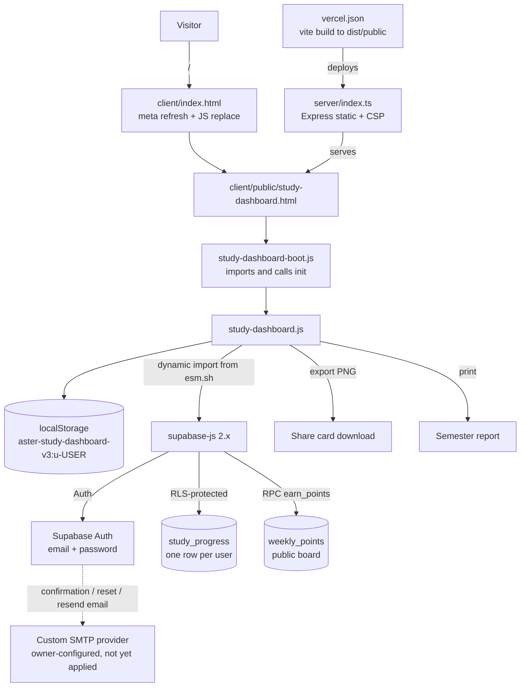

# Architecture — SEM ASSIST

## 1. System overview

PRD foundation added on 2026-10-10: `packages/roadmap-schema` contains the shared
v1.0.0 contract, derived JSON Schema, semantic validator, and reversible legacy
migration staging. Root `roadmap:validate`, `roadmap:check`, and `roadmap:migrate`
scripts expose these tools. They are not wired into dashboard imports or cloud
persistence yet. `apps/web` and `skills/semassist` document future boundaries;
the working product and build paths below remain current (DEC-014/015).

SEM ASSIST ships as a **static, framework-free dashboard page plus a thin hosting
shell**. The entire product lives in two files under `client/public/`:
`study-dashboard.html` (markup plus all CSS in one embedded `<style>` block) and
`study-dashboard.js` (~3,290 lines, an ES module with an explicit trailing
`export { … }` list). The React application in `client/src/` exists only to serve
the dev/build shell: `client/index.html` meta-refreshes and `client/src/pages/Home.tsx`
`location.replace`s the visitor to `/study-dashboard.html`. There is no application
state or business logic in the React tree.

All behavior runs in the browser. Progress is persisted to `localStorage` under a
per-user key, and — when the visitor is signed in — mirrored to Supabase Postgres
through supabase-js (loaded at runtime from `esm.sh`, not bundled). The only
server-side component is `server/index.ts`, an Express host that serves
`dist/public`, applies a strict security-header set, and answers unknown paths with
the real `404.html`. A leaderboard RPC (`public.earn_points`) is the single piece of
server-side business logic, and it lives in Postgres.

Supabase Auth provides email/password identity; Supabase therefore also owns the
delivery of confirmation, resend, and password-reset email through its own SMTP
configuration — which is a project-owner setting no code in this repository can
change (see [.ai/CURRENT_TASK.md](CURRENT_TASK.md)).

## 2. Architecture diagram

## 3. Frontend

- **Routing:** no client router on the product page. `client/index.html` (meta
  refresh) and `client/src/pages/Home.tsx` (wouter route `/`) both redirect to
  `/study-dashboard.html`; `client/src/App.tsx` additionally maps `/404` and a
  fallback to `NotFound`. `wouter` carries a local patch (`patches/wouter@3.7.1.patch`).
- **UI composition:** one HTML document. Sections are addressed by stable ids
  (`#leaderboardBlock`, `#profileSecurity`, `#passwordOverlay`, `#resources`, …) and
  rendered by functions in `study-dashboard.js` (`renderTracks`, `renderWeeklyProgress`,
  `renderProfile`, `renderActivity`, `renderMissionQueue`, `renderReviewQueue`,
  `renderResources`, `renderCustomTasks`).
- **Styling:** hand-written CSS inside the HTML's `<style>` block, driven by CSS
  custom properties (pearl-gray surface, warm yellow accent, charcoal ink) with a
  `:root[data-theme="dark"]` variant. `client/public/theme.js` and
  `client/src/contexts/ThemeContext.tsx` handle theme; the choice persists under
  `sem-assist-theme`.
- **State:** a single plain object (`completed`, `completedAt`, `activity`,
  `customTasks`, `resources`) normalized by `normalizeState()` and migrated from
  older shapes by `migrateLegacy()`.
- **Exports:** the profile card and semester report are built as SVG strings
  (`buildProfileCardSvg`, `buildSemesterReport`) and rasterized in-browser
  (`svgToPngBlob`) or printed.
- **Data fetching:** only Supabase, and only lazily — `ensureSupabase()` dynamically
  imports supabase-js from `https://esm.sh/@supabase/supabase-js@2.115.0` on first use.
  The import seam `setSupabaseClientFactory(factory)` exists for tests.

## 4. Backend

`server/index.ts` is a static host, not an API:

- `express.static(dist/public)` — in production it resolves next to the bundled
  server; otherwise it serves the build output directory.
- A catch-all `app.get("*")` returns `404.html` with status 404 (instead of silently
  serving `index.html` for everything).
- `securityHeaders` middleware sets CSP, `X-Content-Type-Options`, `X-Frame-Options`,
  `Referrer-Policy`, `Permissions-Policy`, `Cross-Origin-Opener-Policy`,
  `Cross-Origin-Resource-Policy`, and HSTS in production. The CSP is kept in sync
  **by hand** with the `<meta>` tag in `study-dashboard.html`, and both are enforced
  additively — changing one without the other silently breaks the page.
- Port: `process.env.PORT || 3000`.

Business logic that would normally be "backend" is either in the browser or inside
Postgres (`earn_points`).

## 5. Data layer

Two Postgres tables and one RPC, all defined in `supabase/schema.sql` (idempotent;
must be pasted once into the Supabase SQL Editor by a project owner):

| Object | Purpose | Access |
| --- | --- | --- |
| `public.study_progress` | one JSONB `state` blob per user (`user_id` PK) | RLS: read/insert/update only your own row |
| `public.weekly_points` | leaderboard, one row per `(user_id, week_start)` | RLS: **any** signed-in user may read; insert/update only your own row |
| `public.earn_points(p_user_id, p_amount, p_display_name, p_week_start)` | atomic signed point change for the caller's own row | `security definer`, `execute` granted to `authenticated` |

`localStorage` is the primary store and works with no backend at all. Per-user key:
`aster-study-dashboard-v3:u-<userId>` (plus `LEGACY_KEY` for pre-migration data,
`COOKIE_CONSENT_KEY`, `semassist-resource-snap`). Unapplied schema is the single
most common failure mode: cloud saves fail with a visible "Could not save progress"
toast and the leaderboard stays empty.

## 6. Authentication and authorization

- **Identity:** Supabase Auth, email + password. The publishable key and URL live in
  `client/public/supabase-config.js`; `redirectUrl` is derived from
  `window.location.origin` so every environment needs no code change.
- **Session application:** `init()` captures `window.location.hash` **before** the
  client initializes (supabase-js consumes the fragment), subscribes
  `onAuthStateChange` **before** reading the boot session, and defers `applySession`
  with `setTimeout(…, 0)` — the auth callback must stay synchronous or the client
  deadlocks on its own lock.
- **Authorization:** entirely in Postgres RLS, plus `earn_points` verifying
  `p_user_id = auth.uid()` and rejecting a `p_week_start` that is not the caller's
  local Monday (or one week either side of the UTC week boundary, for time zones).
- **Flows:** sign-up, email confirmation (with a "Resend confirmation email"
  retry), sign-in, sign-out, magic-link template, password reset by recovery link
  (`beginPasswordReset` mode on the auth card), and — while signed in — a
  change-password dialog that rotates the password with no email round trip.
- **Failure mapping:** `authErrorMessage(error, signup)` turns provider errors into
  actionable copy (rate limit, expired/reused reset link, unconfirmed email,
  already registered, bad credentials, and a mailer/SMTP explanation for a 5xx
  sign-up). Unrecognized errors are shown verbatim rather than reworded.

## 7. External services

| Service | Purpose | Evidence |
| --- | --- | --- |
| Supabase (Postgres + Auth) | identity, per-user sync, leaderboard | `client/public/supabase-config.js`, `supabase/schema.sql` |
| esm.sh | runtime CDN for `@supabase/supabase-js@2.115.0` | `ensureSupabase()` in `study-dashboard.js` |
| Google Fonts | Space Grotesk / Inter | CSP `style-src`/`font-src` in `server/index.ts` |
| Resend (proposed) | custom SMTP for Supabase Auth mail | `scripts/configure-auth-smtp.mjs`, [continue.md](../continue.md) |
| Vercel | production hosting | `vercel.json` |
| Manus dev tooling | injected runtime + debug-log collector, **dev-only** | `vite.config.ts` (gated on `NODE_ENV !== "production"`) |

## 8. Deployment

- `vercel.json`: `buildCommand: vite build`, `outputDirectory: dist/public`, a `/`
  rewrite to `/study-dashboard.html`, and the security-header set.
- Production alias: https://semassist.runs-on.dev (verified reachable — the branded
  email templates link to it).
- The Express server is the alternative host (`npm run build` then
  `NODE_ENV=production node dist/index.js`).
- Deployment status is configuration-level evidence only; this memory does not
  assert what is currently live beyond the alias responding.

## 9. Data flows

1. **Boot:** `/` → `client/index.html` redirect → `study-dashboard.html` →
   `study-dashboard-boot.js` imports and calls `init()`; `init()` loads local state,
   renders, then lazily initializes Supabase if configured.
2. **Load:** `loadLocalState(userId)` reads the per-user key; on sign-in
   `applySession(user)` reads the `study_progress` row and uploads the local state if
   no cloud row exists (coalesced so concurrent applies of one user share one read).
3. **Save:** `saveState()` debounces into `flushCloudSave()` (upsert
   `study_progress`); `keepaliveFlush()` handles page unload.
4. **Checkpoint tick:** `toggleTask()` updates state, re-renders, and fire-and-forgets
   `awardPoints(±10)` → `rpc('earn_points', …)` with the caller's local Monday. Award
   failures intentionally never toast.
5. **Focus session:** the timer's stop path journals the session and calls
   `addFocusMinutes()` → `awardPoints(minutes)`.
6. **Leaderboard:** `refreshLeaderboard()` selects `weekly_points` where
   `week_start = weekStartKey()`; `scheduleLeaderboardRefresh()` debounces and pins
   the document it was queued for.
7. **Auth events:** `onAuthStateChange` → deferred `applySession` (and
   `beginPasswordReset` on `PASSWORD_RECOVERY`, handled before the apply);
   `showSignedInChrome(user)` is the single toggle for signed-in chrome.
8. **Auth email (target state, not yet live):** Supabase Auth sends confirmation /
   reset / resend mail through the owner-configured SMTP provider.

## 10. Architectural boundaries and constraints

- The static page may not assume any bundler: it loads supabase-js from `esm.sh` and
  must keep the CSP's `script-src`/`connect-src` allowlists in step with that.
- `study-dashboard.html` holds both markup and styles; there is no CSS build step for
  the product page, so styling changes are edits to that embedded `<style>` block.
- The publishable Supabase key may live in the client **only** because RLS is the
  authorization boundary. A `service_role` key must never appear in the repo.
- Task ids are derived from track id + zero-based index (`python30-1`), so reordering
  a track's checkpoint list would orphan stored completion state.
- Point awards are client-initiated by design; the RPC is the enforcement point, and
  the leaderboard is intentionally public to signed-in users.
- `drizzle/schema.ts` and `drizzle/relations.ts` are tracked but not imported by any
  code and `drizzle-orm` is not a dependency — treat as unused scaffolding.
- Email delivery is an owner-only, out-of-band concern: no repository code can fix a
  broken Supabase mailer.

## 11. Evidence and unresolved questions

- Evidence: `package.json`; `vite.config.ts`; `server/index.ts`; `vercel.json`;
  `client/index.html`; `client/src/App.tsx`; `client/src/pages/Home.tsx`;
  `client/public/study-dashboard-boot.js`; `client/public/supabase-config.js`;
  `supabase/schema.sql`; `scripts/configure-auth-smtp.mjs`; `continue.md`;
  `README.md`; `.github/workflows/ci.yml`.
- **Not verified:** whether `supabase/schema.sql` has ever been applied to the live
  project; whether the branded email templates have been pasted into the dashboard;
  whether any deployment is currently live beyond the production alias responding;
  the actual row contents of the live database.
- **Not verified in this environment:** the live Supabase project host
  (`nrxbelpmydquivcphxry.supabase.co`) did not resolve for `curl`/`node fetch` during
  the last session, so live auth settings could not be re-read.
